# Database Entity-Relationship Diagram

25 tables across 9 domains. Primary keys are `TEXT` in all tables; most are nanoid IDs, and `role_permissions` uses a composite key (`role_id`, `permission`). All timestamps are UTC ISO-8601.

```mermaid
erDiagram
    %% ═══════════════════════════════════════
    %% Domain: Auth & Identity
    %% ═══════════════════════════════════════

    roles {
        text id PK
        text name
        int level
        text color "nullable"
        int is_builtin "boolean, default false"
        text created_at
        text updated_at
    }

    role_permissions {
        text role_id PK,FK "CASCADE on delete"
        text permission PK
        int granted "boolean, default true"
    }

    users {
        text id PK
        text username UK "unique"
        text role "admin | moderator | member"
        int is_active "boolean, default true"
        text deleted_at "nullable"
        text created_at
        text updated_at
    }

    user_auth_password {
        text user_id PK,FK
        text password_hash
        text salt
        text updated_at
    }

    sessions {
        text id PK
        text user_id FK "CASCADE on delete"
        text expires_at
        text created_at
    }

    invite_links {
        text id PK
        text code UK "unique"
        text created_by FK
        int max_uses
        int used_count "default 0"
        text expires_at "nullable"
        text created_at
        text revoked_at "nullable"
    }

    discord_link_codes {
        text id PK
        text user_id FK
        text discord_id
        text code
        text expires_at
        int used "boolean"
        text created_at
    }

    %% ═══════════════════════════════════════
    %% Domain: Member Profiles
    %% ═══════════════════════════════════════

    member_profiles {
        text id PK
        text user_id FK,UK "unique"
        text wechat_name "nullable"
        int power "default 0"
        text classes "JSON array"
        text title_html "nullable"
        text bio "nullable"
        text images "JSON array"
        text audio_key "nullable"
        text video_urls "JSON array"
        text availability "nullable"
        text vacation_start "nullable"
        text vacation_end "nullable"
        text discord_id UK "unique, nullable"
        int discord_reminder_opt_out "boolean"
        text notes "nullable"
        text created_at
        text updated_at
    }

    %% ═══════════════════════════════════════
    %% Domain: Events & Signups
    %% ═══════════════════════════════════════

    events {
        text id PK
        text type "weekly_mission | guild_war | social | other"
        text title
        text description "nullable"
        text start_at
        text end_at "nullable"
        int capacity "nullable"
        int pinned "boolean"
        int signup_locked "boolean"
        text archived_at "nullable"
        text created_by FK
        text recurrence_rule "nullable JSON"
        text attachments "JSON array"
        text series_id "nullable"
        int is_series_parent "boolean"
        text instance_date "nullable"
        text last_generated_date "nullable"
        int generation_count "default 0"
        text created_at
        text updated_at
    }

    event_participants {
        text id PK
        text event_id FK "CASCADE on delete"
        text user_id FK
        text joined_at
    }

    %% ═══════════════════════════════════════
    %% Domain: Announcements
    %% ═══════════════════════════════════════

    announcements {
        text id PK
        text title
        text body_json "TipTap JSON"
        int pinned "boolean"
        text pinned_at "nullable"
        text status "draft | scheduled | published | archived"
        text publish_at "nullable"
        text expires_at "nullable"
        text archived_at "nullable"
        text created_by FK
        text created_at
        text updated_at
    }

    %% ═══════════════════════════════════════
    %% Domain: Guild War
    %% ═══════════════════════════════════════

    war_history {
        text id PK
        text event_id FK "nullable"
        text war_name
        text enemy_name "nullable"
        text result "win | loss | draw, nullable"
        real duration_minutes "nullable, > 0"
        int own_kills "nullable"
        int own_towers "nullable"
        int own_base_hp "nullable"
        int own_credits "nullable"
        int own_distance "nullable"
        int enemy_kills "nullable"
        int enemy_towers "nullable"
        int enemy_base_hp "nullable"
        int enemy_credits "nullable"
        int enemy_distance "nullable"
        text notes "nullable"
        text created_by FK
        text created_at
        text updated_at
    }

    war_teams {
        text id PK
        text war_history_id FK "CASCADE on delete"
        text team_name
        int sort_order "default 0"
        text notes "nullable"
        int is_locked "boolean"
    }

    war_team_members {
        text id PK
        text war_team_id FK "CASCADE on delete"
        text user_id FK
        text role_tag "nullable"
        int sort_order "default 0"
        int kills "nullable"
        int deaths "nullable"
        int assists "nullable"
        int damage "nullable"
        int healing "nullable"
        int building_damage "nullable"
        int credits "nullable"
        int damage_taken "nullable"
        text note "nullable"
    }

    war_pool_members {
        text id PK
        text war_history_id FK "CASCADE on delete"
        text user_id FK
    }

    war_templates {
        text id PK
        text template_name
        text description "nullable"
        text source_event_id FK "nullable"
        text payload_json "JSON"
        text created_by FK
        text created_at
        text updated_at
    }

    %% ═══════════════════════════════════════
    %% Domain: Wiki
    %% ═══════════════════════════════════════

    wiki_categories {
        text id PK
        text name
        text slug UK "unique"
        int sort_order "default 0"
        text parent_id "self-ref, nullable"
        text created_at
        text updated_at
    }

    wiki_articles {
        text id PK
        text title
        text slug UK "unique"
        text category_id FK
        text body_json "TipTap JSON"
        int sort_order "default 0"
        text archived_at "nullable"
        text created_by FK
        text updated_by FK "nullable"
        text created_at
        text updated_at
    }

    %% ═══════════════════════════════════════
    %% Domain: Gallery
    %% ═══════════════════════════════════════

    gallery_items {
        text id PK
        text type "image | video"
        text url
        text caption "nullable"
        text uploaded_by FK
        text created_at
    }

    gallery_likes {
        text id PK
        text gallery_item_id FK "CASCADE on delete"
        text user_id FK
        text created_at
    }

    gallery_comments {
        text id PK
        text gallery_item_id FK "CASCADE on delete"
        text user_id FK
        text body "max 500 chars"
        text created_at
        text updated_at
    }

    %% ═══════════════════════════════════════
    %% Domain: Audit Log
    %% ═══════════════════════════════════════

    audit_log {
        text id PK
        text entity_type
        text action
        text actor_id FK
        text entity_id
        text diff_title "nullable"
        text detail_text "nullable"
        text created_at
    }

    %% ═══════════════════════════════════════
    %% Domain: Bot Delivery & Platform Integration
    %% ═══════════════════════════════════════

    bot_delivery_log {
        text id PK
        text idempotency_key UK "unique"
        text platform "discord | wechat"
        text task_type "event_notify | team_comp | reminder | war_result"
        text event_id FK "nullable"
        text target_id
        text payload_json "JSON"
        text status "queued | sending | sent | failed"
        int attempt_count "default 0"
        text last_error "nullable"
        text next_attempt_at "nullable"
        text created_at
        text sent_at "nullable"
        text message_id "nullable"
    }

    bot_discord_event_messages {
        text id PK
        text event_id FK
        text channel_id
        text message_id
        text created_at
    }

    bot_wechat_event_messages {
        text id PK
        text event_id FK
        text room_id
        text message_id
        text created_at
    }

    %% ═══════════════════════════════════════
    %% Relationships
    %% ═══════════════════════════════════════

    %% Auth domain
    roles ||--o{ role_permissions : "grants (CASCADE)"
    users ||--o| user_auth_password : "credentials"
    users ||--o{ sessions : "active sessions (CASCADE)"
    users ||--o{ invite_links : "created by"
    users ||--o{ discord_link_codes : "links discord"

    %% Member domain
    users ||--o| member_profiles : "profile (1:1)"

    %% Events domain
    users ||--o{ events : "created by"
    events ||--o{ event_participants : "signups (CASCADE)"
    users ||--o{ event_participants : "joined"

    %% Announcements
    users ||--o{ announcements : "created by"

    %% Guild War domain
    events ||--o{ war_history : "linked event"
    users ||--o{ war_history : "created by"
    war_history ||--o{ war_teams : "teams (CASCADE)"
    war_teams ||--o{ war_team_members : "members (CASCADE)"
    users ||--o{ war_team_members : "assigned to"
    war_history ||--o{ war_pool_members : "pool (CASCADE)"
    users ||--o{ war_pool_members : "in pool"
    events ||--o{ war_templates : "source event"
    users ||--o{ war_templates : "created by"

    %% Wiki domain
    wiki_categories ||--o{ wiki_categories : "parent (self-ref)"
    wiki_categories ||--o{ wiki_articles : "categorized"
    users ||--o{ wiki_articles : "created by"
    %% Gallery domain
    users ||--o{ gallery_items : "uploaded by"
    gallery_items ||--o{ gallery_likes : "likes (CASCADE)"
    users ||--o{ gallery_likes : "liked by"
    gallery_items ||--o{ gallery_comments : "comments (CASCADE)"
    users ||--o{ gallery_comments : "commented by"

    %% Audit
    users ||--o{ audit_log : "actor"

    %% Bot
    events ||--o{ bot_delivery_log : "triggers"
    events ||--o{ bot_discord_event_messages : "posted to discord"
    events ||--o{ bot_wechat_event_messages : "posted to wechat"
```



## Cascade Delete Chain

```
users
├── sessions              (CASCADE)
├── event_participants     (via events CASCADE)
└── (no cascade on member_profiles, audit_log, etc.)

roles
└── role_permissions       (CASCADE)

events
└── event_participants     (CASCADE)

war_history
├── war_teams              (CASCADE)
│   └── war_team_members   (CASCADE)
└── war_pool_members       (CASCADE)

gallery_items
├── gallery_likes          (CASCADE)
└── gallery_comments       (CASCADE)
```

## Domain Boundaries

| Domain | Tables | Root FK |
|--------|--------|---------|
| Auth & Identity | roles, role_permissions, users, user_auth_password, sessions, invite_links, discord_link_codes | — (root) |
| Member Profiles | member_profiles | users |
| Events & Signups | events, event_participants | users |
| Announcements | announcements | users |
| Guild War | war_history, war_teams, war_team_members, war_pool_members, war_templates | users, events |
| Wiki | wiki_categories, wiki_articles | users |
| Gallery | gallery_items, gallery_likes, gallery_comments | users |
| Audit Log | audit_log | users |
| Bot Delivery | bot_delivery_log, bot_discord_event_messages, bot_wechat_event_messages | events |
