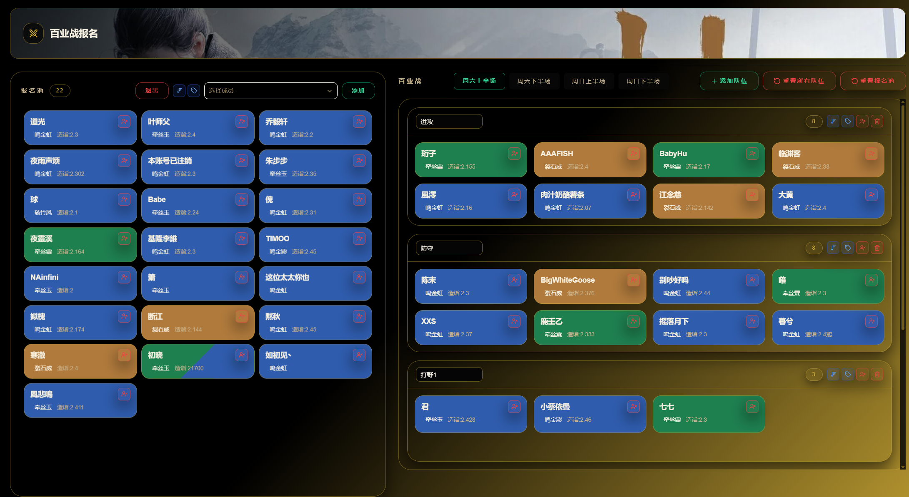
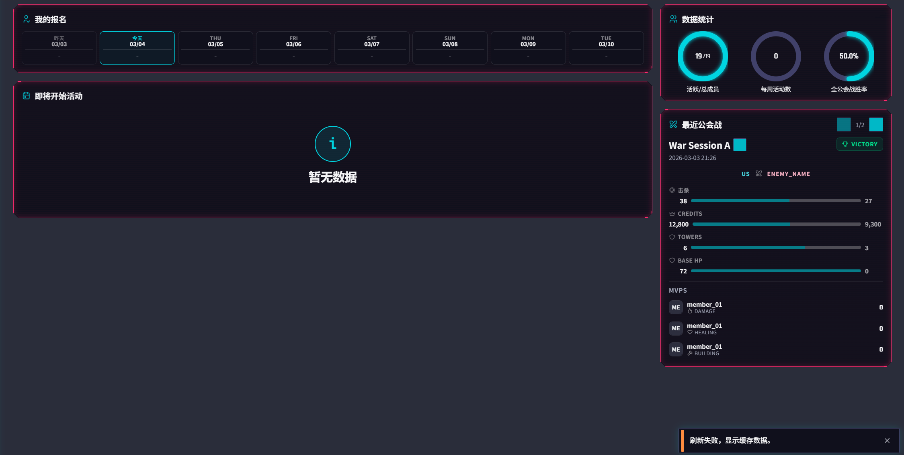

 damage and healing, still added to search box, but i dont want that, i just want the blue text in drop down ad the check mark

war analysis should have normalization like document described in planning folder.

event page, height of these badge and header of evemt card should be higher, right now broder is clipping the text on badge. 
also for event card, remove view all button, instead, make it so clicking on the card bring up add detail of the event, title, description, time, members signed up, attatchments. 

active war page should have a layout in the image, that has a bunch of member card, and support drag dorp into different teams, and admin can add team, delete team, clear team, add member into pool via dropdown select, change team name, change team description, remove member from war event

main dashboard not loading events that are going to happen soon.